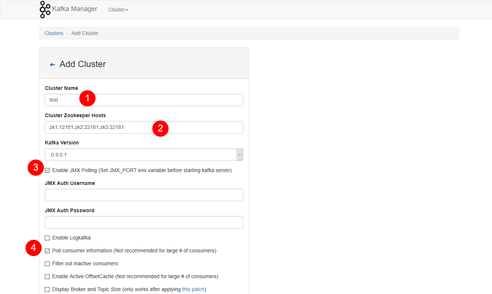
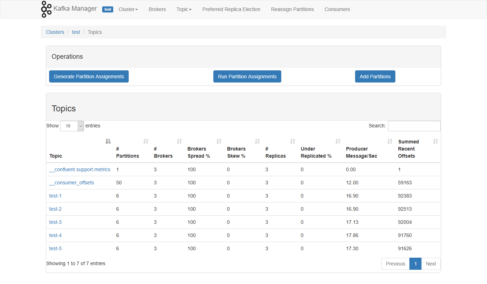
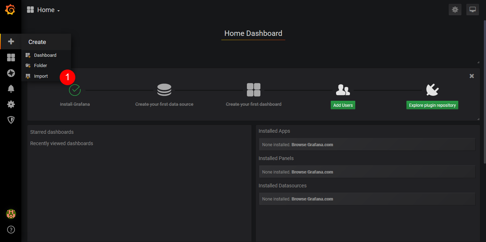
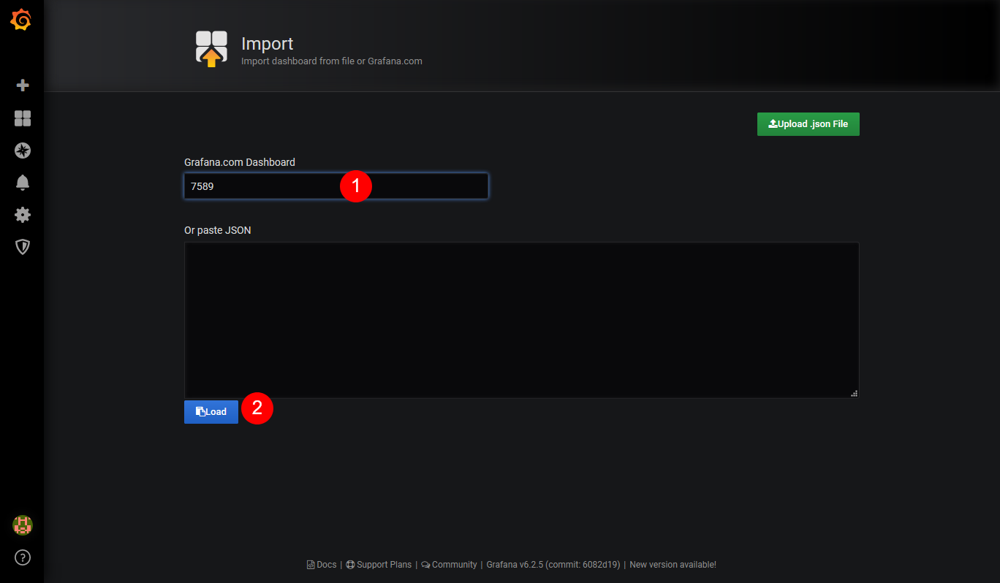
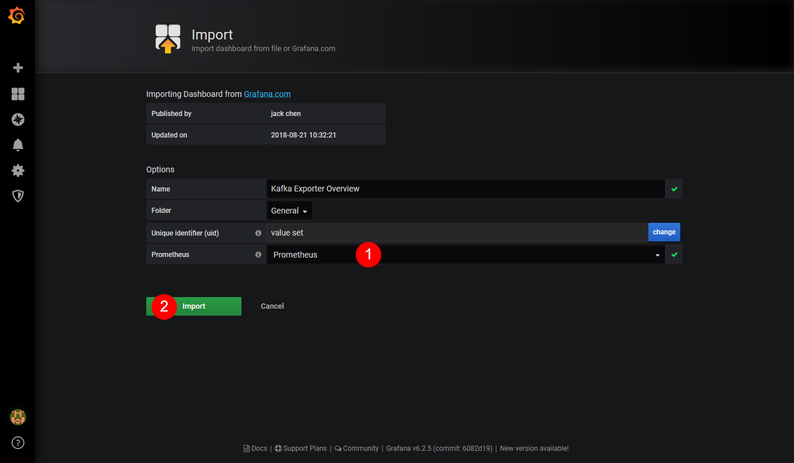
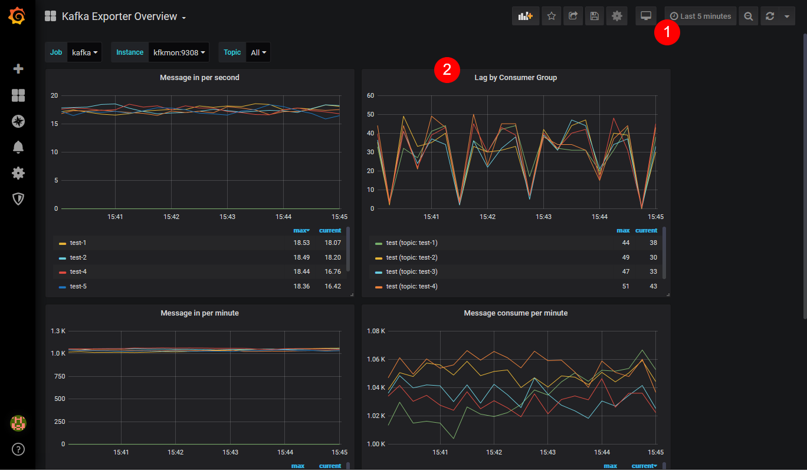
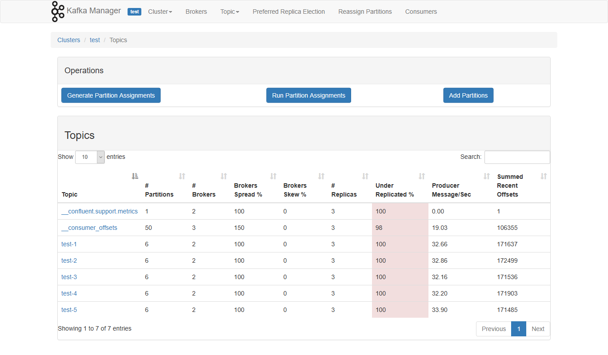

# kafka-ha-demo
A project for demostrating a kafka cluster.

## Topology

Zookeeper servers are called ZK1, ZK2, ZK3.
Kafka servers are called KF1, KF2, KF3.
Producer are called P.
Consumer are called C.
Utility servers are not included.
```
+-----+     +-----+     +-----+
| ZK1 |--+--| ZK2 |--+--| ZK3 |
+-----+  |  +-----+  |  +-----+
         |           |
+-----+  |  +-----+  |  +-----+
| KF1 |--+--| KF2 |--+--| KF3 |
+-----+     +-----+     +-----+
   |                       |
+-----+                 +-----+
|  P  |                 |  C  |
+-----+                 +-----+
```

## Setup

1. Run following commands to start this lab.
```bash
docker-compose up
```

2. Waiting for Kafka to be started.
```
kafka1_1          | [2019-08-09 05:50:10,306] INFO [KafkaServer id=1] started (kafka.server.KafkaServer
```

3. Open following url, then add existing kafka cluster:
```
Kafka Manager: http://localhost:9000
```




4. Open following url, the add Kafka exporter dashboard:
```
Grafana: http://localhost:3000
```
**Note: Datasource is already configured.**







## Test
1. Run following command to scale-out producer.
```bash
docker-compose scale producer=2
```

2. Run following command to stop kafka2 (in another terminal session)
```bash
docker-compose stop kafka2
```

```bash
consumer_1        | [2019-08-09 08:24:21.170][base.py:979][WARNING]Heartbeat session expired, marking coordinator dead
consumer_1        | [2019-08-09 08:24:21.171][base.py:833][WARNING]Heartbeat: local member_id was not recognized; this consumer needs to re-join
consumer_1        | [2019-08-09 08:24:21.171][base.py:710][WARNING]Marking the coordinator dead (node 3) for group test: Heartbeat session expired.
consumer_1        | [2019-08-09 08:24:21.172][consumer.py:532][ERROR]Offset commit failed: This is likely to cause duplicate message delivery
consumer_1        | Traceback (most recent call last):
consumer_1        |   File "/usr/local/lib/python3.7/site-packages/kafka/coordinator/consumer.py", line 521, in _maybe_auto_commit_offsets_sync
consumer_1        |     self.commit_offsets_sync(self._subscription.all_consumed_offsets())
consumer_1        |   File "/usr/local/lib/python3.7/site-packages/kafka/coordinator/consumer.py", line 514, in commit_offsets_sync
consumer_1        |     raise future.exception # pylint: disable-msg=raising-bad-type
consumer_1        | kafka.errors.CommitFailedError: CommitFailedError: Commit cannot be completed since the group has already
consumer_1        |             rebalanced and assigned the partitions to another member.
consumer_1        |             This means that the time between subsequent calls to poll()
consumer_1        |             was longer than the configured max_poll_interval_ms, which
consumer_1        |             typically implies that the poll loop is spending too much
consumer_1        |             time message processing. You can address this either by
consumer_1        |             increasing the rebalance timeout with max_poll_interval_ms,
consumer_1        |             or by reducing the maximum size of batches returned in poll()
consumer_1        |             with max_poll_records.
consumer_1        |
consumer_1        | [2019-08-09 08:24:21.200][consumer.py:342][INFO]Revoking previously assigned partitions {TopicPartition(topic='test-2', partition=2), TopicPartition(topic='test-4', partition=3), TopicPartition(topic='test-5', partition=3), TopicPartition(topic='test-1', partition=0), TopicPartition(topic='test-3', partition=2), TopicPartition(topic='test-1', partition=4), TopicPartition(topic='test-2', partition=3), TopicPartition(topic='test-4', partition=2), TopicPartition(topic='test-5', partition=2), TopicPartition(topic='test-2', partition=4), TopicPartition(topic='test-3', partition=3), TopicPartition(topic='test-1', partition=3), TopicPartition(topic='test-2', partition=0), TopicPartition(topic='test-5', partition=4), TopicPartition(topic='test-4', partition=4), TopicPartition(topic='test-2', partition=5), TopicPartition(topic='test-3', partition=4), TopicPartition(topic='test-4', partition=1), TopicPartition(topic='test-5', partition=1), TopicPartition(topic='test-1', partition=2), TopicPartition(topic='test-2', partition=1), TopicPartition(topic='test-3', partition=0), TopicPartition(topic='test-4', partition=5), TopicPartition(topic='test-5', partition=5), TopicPartition(topic='test-4', partition=0), TopicPartition(topic='test-3', partition=5), TopicPartition(topic='test-5', partition=0), TopicPartition(topic='test-1', partition=1), TopicPartition(topic='test-3', partition=1), TopicPartition(topic='test-1', partition=5)} for group test
consumer_1        | [2019-08-09 08:24:21.202][cluster.py:376][INFO]Group coordinator for test is BrokerMetadata(nodeId=3, host='kafka3', port=39092, rack=None)
consumer_1        | [2019-08-09 08:24:21.202][base.py:688][INFO]Discovered coordinator 3 for group test
consumer_1        | [2019-08-09 08:24:21.202][base.py:447][INFO](Re-)joining group test
consumer_1        | [2019-08-09 08:24:24.207][base.py:516][INFO]Elected group leader -- performing partition assignments using range
consumer_1        | [2019-08-09 08:24:24.223][base.py:333][INFO]Successfully joined group test with generation 3
consumer_1        | [2019-08-09 08:24:24.224][subscription_state.py:257][INFO]Updated partition assignment: [TopicPartition(topic='test-1', partition=0), TopicPartition(topic='test-1', partition=1), TopicPartition(topic='test-1', partition=2), TopicPartition(topic='test-1', partition=3), TopicPartition(topic='test-1', partition=4), TopicPartition(topic='test-1', partition=5), TopicPartition(topic='test-2', partition=0), TopicPartition(topic='test-2', partition=1), TopicPartition(topic='test-2', partition=2), TopicPartition(topic='test-2', partition=3), TopicPartition(topic='test-2', partition=4), TopicPartition(topic='test-2', partition=5), TopicPartition(topic='test-3', partition=0), TopicPartition(topic='test-3', partition=1), TopicPartition(topic='test-3', partition=2), TopicPartition(topic='test-3', partition=3), TopicPartition(topic='test-3', partition=4), TopicPartition(topic='test-3', partition=5), TopicPartition(topic='test-4', partition=0), TopicPartition(topic='test-4', partition=1), TopicPartition(topic='test-4', partition=2), TopicPartition(topic='test-4', partition=3), TopicPartition(topic='test-4', partition=4), TopicPartition(topic='test-4', partition=5), TopicPartition(topic='test-5', partition=0), TopicPartition(topic='test-5', partition=1), TopicPartition(topic='test-5', partition=2), TopicPartition(topic='test-5', partition=3), TopicPartition(topic='test-5', partition=4), TopicPartition(topic='test-5', partition=5)]
consumer_1        | [2019-08-09 08:24:24.224][consumer.py:239][INFO]Setting newly assigned partitions {TopicPartition(topic='test-2', partition=2), TopicPartition(topic='test-3', partition=1), TopicPartition(topic='test-4', partition=4), TopicPartition(topic='test-4', partition=3), TopicPartition(topic='test-5', partition=3), TopicPartition(topic='test-1', partition=0), TopicPartition(topic='test-2', partition=5), TopicPartition(topic='test-3', partition=4), TopicPartition(topic='test-4', partition=1), TopicPartition(topic='test-5', partition=1), TopicPartition(topic='test-1', partition=2), TopicPartition(topic='test-3', partition=2), TopicPartition(topic='test-1', partition=4), TopicPartition(topic='test-2', partition=1), TopicPartition(topic='test-3', partition=0), TopicPartition(topic='test-4', partition=5), TopicPartition(topic='test-5', partition=5), TopicPartition(topic='test-2', partition=3), TopicPartition(topic='test-1', partition=5), TopicPartition(topic='test-4', partition=2), TopicPartition(topic='test-5', partition=2), TopicPartition(topic='test-4', partition=0), TopicPartition(topic='test-3', partition=5), TopicPartition(topic='test-5', partition=0), TopicPartition(topic='test-2', partition=4), TopicPartition(topic='test-3', partition=3), TopicPartition(topic='test-1', partition=1), TopicPartition(topic='test-1', partition=3), TopicPartition(topic='test-5', partition=4), TopicPartition(topic='test-2', partition=0)} for group test
```


3. Run following command to start kafka2
```bash
docker-compose start kafka2
```

```bash
consumer_1        | [2019-08-09 09:25:40.237][consumer.py:342][INFO]Revoking previously assigned partitions {TopicPartition(topic='test-2', partition=2), TopicPartition(topic='test-4', partition=3), TopicPartition(topic='test-5', partition=3), TopicPartition(topic='test-1', partition=0), TopicPartition(topic='test-3', partition=2), TopicPartition(topic='test-1', partition=4), TopicPartition(topic='test-2', partition=3), TopicPartition(topic='test-4', partition=2), TopicPartition(topic='test-5', partition=2), TopicPartition(topic='test-2', partition=4), TopicPartition(topic='test-3', partition=3), TopicPartition(topic='test-1', partition=3), TopicPartition(topic='test-2', partition=0), TopicPartition(topic='test-5', partition=4), TopicPartition(topic='test-4', partition=4), TopicPartition(topic='test-2', partition=5), TopicPartition(topic='test-3', partition=4), TopicPartition(topic='test-4', partition=1), TopicPartition(topic='test-5', partition=1), TopicPartition(topic='test-1', partition=2), TopicPartition(topic='test-2', partition=1), TopicPartition(topic='test-3', partition=0), TopicPartition(topic='test-4', partition=5), TopicPartition(topic='test-5', partition=5), TopicPartition(topic='test-4', partition=0), TopicPartition(topic='test-3', partition=5), TopicPartition(topic='test-5', partition=0), TopicPartition(topic='test-1', partition=1), TopicPartition(topic='test-3', partition=1), TopicPartition(topic='test-1', partition=5)} for group test
consumer_1        | [2019-08-09 09:25:40.237][base.py:447][INFO](Re-)joining group test
consumer_1        | [2019-08-09 09:25:43.276][base.py:516][INFO]Elected group leader -- performing partition assignments using range
consumer_1        | [2019-08-09 09:25:43.299][base.py:333][INFO]Successfully joined group test with generation 12
consumer_1        | [2019-08-09 09:25:43.300][subscription_state.py:257][INFO]Updated partition assignment: [TopicPartition(topic='test-1', partition=0), TopicPartition(topic='test-1', partition=1), TopicPartition(topic='test-1', partition=2), TopicPartition(topic='test-1', partition=3), TopicPartition(topic='test-1', partition=4), TopicPartition(topic='test-1', partition=5), TopicPartition(topic='test-2', partition=0), TopicPartition(topic='test-2', partition=1), TopicPartition(topic='test-2', partition=2), TopicPartition(topic='test-2', partition=3), TopicPartition(topic='test-2', partition=4), TopicPartition(topic='test-2', partition=5), TopicPartition(topic='test-3', partition=0), TopicPartition(topic='test-3', partition=1), TopicPartition(topic='test-3', partition=2), TopicPartition(topic='test-3', partition=3), TopicPartition(topic='test-3', partition=4), TopicPartition(topic='test-3', partition=5), TopicPartition(topic='test-4', partition=0), TopicPartition(topic='test-4', partition=1), TopicPartition(topic='test-4', partition=2), TopicPartition(topic='test-4', partition=3), TopicPartition(topic='test-4', partition=4), TopicPartition(topic='test-4', partition=5), TopicPartition(topic='test-5', partition=0), TopicPartition(topic='test-5', partition=1), TopicPartition(topic='test-5', partition=2), TopicPartition(topic='test-5', partition=3), TopicPartition(topic='test-5', partition=4), TopicPartition(topic='test-5', partition=5)]
```

## Cleanup

Run following command to stop and remove all containers.
```bash
docker-compose down
```

## Note

Please feel free to extend the test steps.

## References

* https://github.com/simplesteph/kafka-stack-docker-compose/blob/master/full-stack.yml
* https://grafana.com/docs/administration/provisioning/
